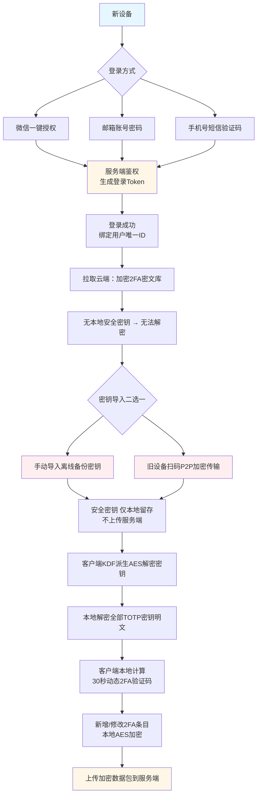
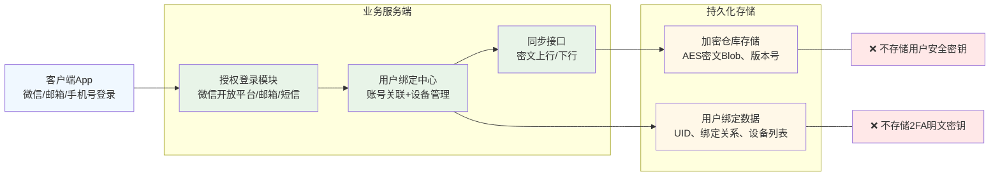

下面给你两张图：
1. **用户登录+密钥迁移完整流程图**（微信/邮箱/手机号三登录）
2. **服务端整体架构图**（零知识、只存密文、不碰2FA明文密钥）

## 图1：登录 + 安全密钥分发 + 2FA同步 完整流程

---

## 图2：服务端架构图（零知识核心）

---

## 关键设计约束（直接落地开发）
1. **登录层**
- 微信、邮箱、手机号 **只做身份认证**，用来区分用户
- 服务端只存：UID、绑定关系、设备列表、登录凭证

2. **安全密钥（对标1Password Secret Key）**
- 注册/首次打开App：**客户端本地随机生成**
- 全程：**不上传、不落地服务端、不参与接口传输**

3. **2FA 同步规则**
- 所有 TOTP Secret、备注、图标：**客户端AES-GCM加密**
- 服务端只存：加密Blob、更新时间、版本
- 增删改2FA → 本地加密 → 覆盖/增量上传密文

4. **跨设备迁移**
- 方式1：用户手动备份安全密钥文本/二维码，新设备手动输入
- 方式2：旧设备扫码 → 临时P2P加密通道点对点下发安全密钥

我可以再给你一份：**最简数据表结构（MySQL）+ 前后端交互字段设计**，直接可以写代码，要吗？