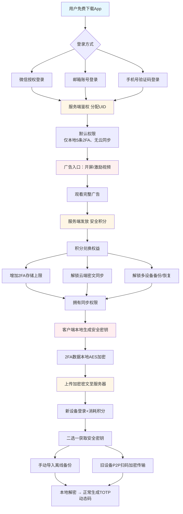
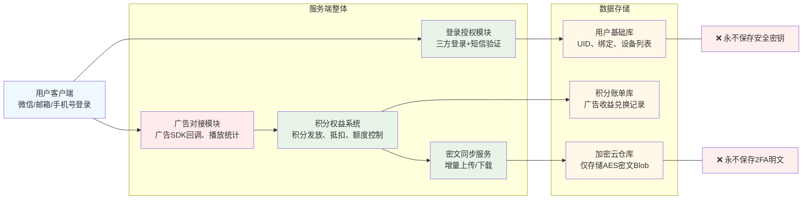

已完整改造：**免费使用 + 广告变现 + 积分体系**，替代付费；
全程保持：**零知识、服务器无明文2FA密钥、E2EE加密**。

附上两套 Mermaid 图：
1. 业务全流程（广告→积分→解锁存储/同步额度）
2. 服务端架构（广告模块+积分系统+免费密文存储）

---

## 一、核心规则（产品逻辑）
1. 软件**永久免费**，无一次性付费、无会员订阅
2. 看激励广告 / 开屏广告 → 发放**安全积分**
3. 积分用途：
   - 解锁更多 2FA 密钥存储条数
   - 解锁跨设备云同步额度
   - 解锁备份导出、批量同步、长期云端留存
4. 无积分：限制少量本地2FA，**禁止云同步**
5. 安全底线不变：
   - TOTP密钥、安全密钥 全程不上传明文
   - 服务端只存加密密文，零知识

---

## 二、流程图：广告 + 积分 + 免费2FA同步

---

## 三、服务端架构图（广告+积分+零知识存储）

---

## 四、极简产品商业化方案（直接落地）
### 1. 广告形式（不打扰核心使用）
- 开屏广告：每次启动 3秒可跳过
- 激励广告：用户主动点击「扩容/开启同步」才弹出
- 无插屏暴力广告、不遮挡2FA动态码

### 2. 积分权益梯度
- 免费基础：本地 5 条 2FA，纯离线使用
- 1次激励广告：+10积分 → 解锁20条存储 + 7天云同步
- 3次广告：解锁永久云同步 + 多设备同步
- 每日看广告：领取每日积分，续期同步权益

### 3. 安全完全不受影响
- 广告、积分、账号系统 和 **加密内核完全隔离**
- 广告SDK无法读取本地2FA密钥、无法触碰加密数据
- 云同步依旧是：**本地加密→服务端存密文→本地解密**

---

需要我顺带给你：
- 极简「数据库表设计」（用户表、积分表、密文同步表）
还是
- 「前端UI逻辑文案」（广告弹窗、积分提示、权益说明）？